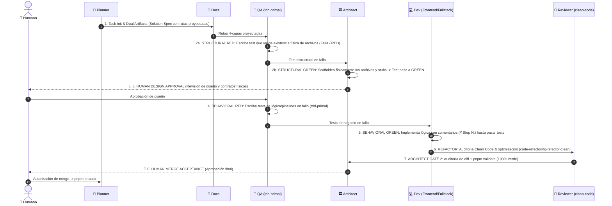

# Canonical SPEC Execution Cycle (Gemini/Antigravity)

## Trigger
- Entrypoint for **ANY** new task, issue, SPEC, feature, fix, or slice of work in the repository.

## Subagent Delegation Map
- `planner`: Orquestación inicial, validación de preconditions y Human Gates.
- `docs`: Sincronización de artefactos duales de requerimientos (`knowledge/features/` o `knowledge/fixes/`) y Linear.
- `architect`: **Gate 1 Structural Scaffolding** (Scaffolding físico de archivos para pasar el test estructural a GREEN) + **Gate 2 Diff Audit**.
- `qa`: **Structural RED & Behavioral RED** (Diseño de tests de contrato y tests de lógica de negocio en fallo mediante el skill `tdd-primal`).
- Especialista de Dominio (`frontend`, `api`, `db`, `state`): **Behavioral GREEN** (Implementación de lógica con comentarios obligatorios).
- `reviewer`: **REFACTOR** (Auditoría de código limpio y remoción de deuda mediante el skill `code-refactoring-refactor-clean`).

---

## Antigravity Execution Sequence

---

## Fases Detalladas

| Fase | Rol / Subagente | Acción / Meta | Evidencia Obligatoria |
| :--- | :--- | :--- | :--- |
| **1. Bootstrap** | `planner` + `docs` | Ejecutar `./scripts/task-init.sh`, poblar artefactos duales sin placeholders y sincronizar el Human Brief en Linear con la lista de archivos proyectados. | `.agents/active_task_state.json` actualizado, Solution Spec con rutas 4-capas. |
| **2a. Structural RED** | `qa` (`tdd-primal`) | Diseñar y escribir un test estructural/contrato que verifique la existencia física y exportaciones esperadas de los archivos proyectados. **Al no existir aún, el test falla (RED).** | Test estructural ejecutado en fallo (`vitest run`). |
| **2b. Structural GREEN (Scaffolding)** | `architect` | El `architect` valida el diseño y **crea físicamente los archivos en el disco** con sus encabezados de capa, contratos de interfaces TypeScript y stubs mínimos. **El test estructural pasa a verde (GREEN).** | Test estructural ejecutado en verde (`vitest run`). Archivos creados en `apps/web/src/`. |
| **🛑 3. Human Design Gate** | Humano | Detener y esperar aprobación humana explícita del diseño arquitectónico y de los contratos físicos creados antes de implementar lógica. | Aprobación del usuario en chat. |
| **4. Behavioral RED (TDD)** | `qa` (`tdd-primal`) | Diseñar y escribir tests exhaustivos de comportamiento, lógica de negocio y pipelines en fallo (RED) contra los stubs existentes. | Tests de lógica en fallo ejecutados con `vitest run`. |
| **5. Behavioral GREEN (Code)** | Especialista (`frontend`/`api`/`db`) | Implementar la lógica de negocio y pipelines paso a paso (`// Step N:`) hasta que todos los tests pasen a verde. | Tests pasando en verde (`vitest run`). |
| **6. REFACTOR (Clean Code)** | `reviewer` (`code-refactoring-refactor-clean`) | Auditar el código, eliminar deuda técnica, código muerto y optimizar estructura manteniendo los tests en verde. | Diff limpio y libre de deuda técnica. |
| **7. Architect Gate 2 & CI** | `architect` + `planner` | `architect` audita el diff final (aislamiento de capas y comentarios). Se ejecuta `pnpm validate` (100% verde). | Salida de `pnpm validate` sin errores ni warnings. |
| **🛑 8. Human Acceptance & PR** | Humano + `planner` | Detener y esperar autorización explícita de merge. Al recibirla, ejecutar `pnpm pr:auto` para abrir y etiquetar el PR. | PR creado con cuerpo generado y tags de GitHub. |
