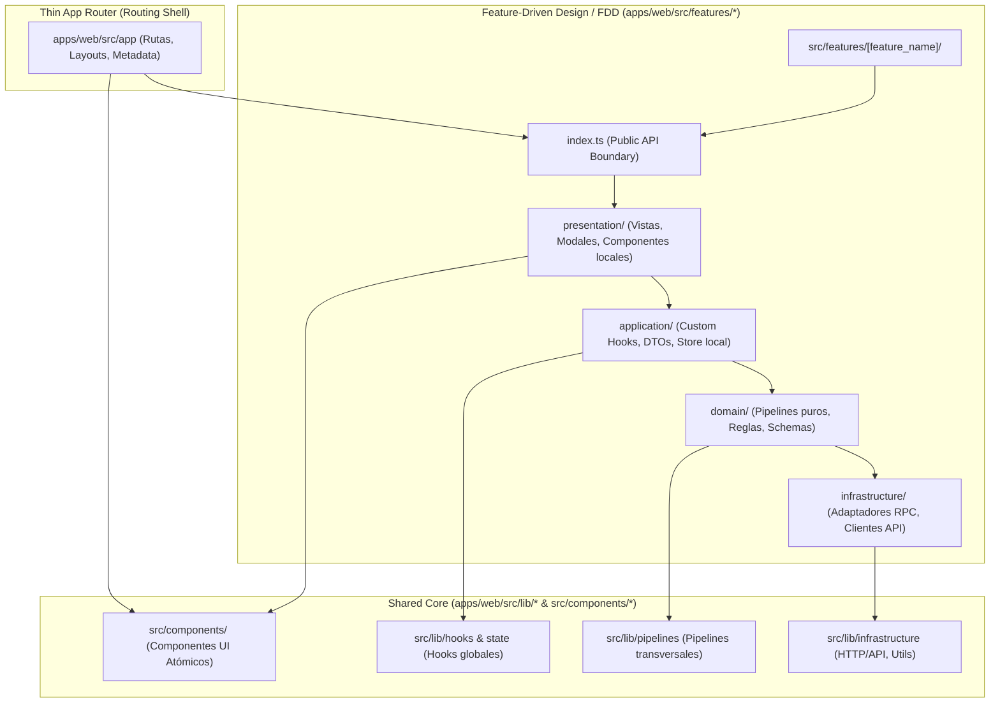

# Architecture Overview — Feature-Driven Design (FDD) & 4-Layer Functional Architecture

## 1. Visión General y Filosofía de Diseño

Este repositorio implementa un modelo híbrido de **Feature-Driven Design (FDD / Vertical Slices)** integrado con una **Arquitectura Funcional en 4 Capas**:



---

## 2. Los Dos Pilares Arquitectónicos

### Pilar 1: Feature-Driven Design (FDD / Vertical Slices)

En lugar de organizar el código por tipo de archivo técnico global (todas las vistas en una carpeta, todos los hooks en otra), el código de negocio se organiza en **rebanadas verticales autónomas** dentro de `apps/web/src/features/[feature_name]/`:

- **Autonomía por Dominio**: Cada feature encapsula todos los elementos necesarios para cumplir con un objetivo de negocio específico.
- **Public API Boundary (`index.ts`)**: Cada feature expone un único punto de entrada (`index.ts`). El resto de la aplicación (y otras features) **solo pueden importar lo exportado en el `index.ts`**, evitando el acoplamiento cruzado de implementación interna.
- **Thin App Router**: `apps/web/src/app/` actúa exclusivamente como una cáscara delgada de enrutamiento (*Thin Routing Shell*), delegando la composición de la UI a los componentes exportados por las features.

### Pilar 2: Arquitectura Funcional en 4 Capas (Nivel Micro)

Dentro de cada feature (y en el código compartido de `src/lib/`), la lógica se divide estrictamente en 4 capas desacopladas con flujo unidireccional:

| Capa | Ubicación | Responsabilidad | Importaciones Permitidas | Prohibiciones Estrictas |
| :--- | :--- | :--- | :--- | :--- |
| **Capa 1: Presentación** | `app/`, `components/`, `features/*/presentation/` | UI React pura, layouts, accesibilidad, Motion 12, Server & Client Components. | Capa 2, Capa 3, UI Compartida | ❌ **PROHIBIDO** importar bases de datos (`pg`), SDKs de transporte raw o lógica de persistencia. |
| **Capa 2: Aplicación / Consumo** | `lib/hooks/`, `lib/state/`, `features/*/application/` | Hooks reactivos, DTOs, mutaciones de estado del cliente (Zustand, React Query). | Capa 3, Capa 4, React Hooks | ❌ **PROHIBIDO** renderizar JSX directo (solo lógica reactiva y estado). |
| **Capa 3: Dominio / Pipelines** | `lib/pipelines/`, `features/*/domain/` | Pipelines funcionales puros de negocio (`pipe()`), validaciones (Zod / Valibot) e invariantes de dominio. | Capa 4, SDKs puros, Zod/Valibot | ❌ **PROHIBIDO** importar React, `next/navigation` o cualquier acoplamiento al framework de UI. |
| **Capa 4: Infraestructura** | `lib/infrastructure/`, `features/*/infrastructure/`, `lib/utils.ts` | Conexión HTTP/API, repositorios de base de datos, servicios cloud, helpers puros de formato. | SDKs de transporte, APIs externas | ❌ **PROHIBIDO** importar componentes visuales o hooks de UI. |

---

## 3. Estructura Canónica de una Feature en FDD

Cuando se crea una nueva funcionalidad de negocio en `apps/web/src/features/[feature_name]/`, debe seguir esta anatomía:

```text
apps/web/src/features/[feature_name]/
├── index.ts                      <-- 🛡️ Public API Boundary (Barrel Export)
├── presentation/                 <-- Capa 1: Componentes visuales y vistas locales
│   ├── [feature]-view.tsx
│   ├── [feature]-view.test.tsx   <-- 🧪 Test colocalizado de UI
│   └── [feature]-modal.tsx
├── application/                  <-- Capa 2: Hooks de consumo y estado local
│   ├── use-[feature]-state.ts
│   ├── use-[feature]-state.test.ts <-- 🧪 Test colocalizado de hook
│   └── [feature]-dto.ts
├── domain/                       <-- Capa 3: Pipelines puros, schemas e invariantes
│   ├── [feature]-pipeline.ts
│   ├── [feature]-pipeline.test.ts <-- 🧪 Test colocalizado de lógica/pipeline
│   └── [feature]-schema.ts
└── infrastructure/               <-- Capa 4: Adaptadores de API y servicios externos
    ├── [feature]-adapter.ts
    └── [feature]-adapter.test.ts <-- 🧪 Test colocalizado de adaptador
```

### 3.1. Estrategia de Testing Híbrida: Colocalizado + Centralizado

1. **Tests Colocalizados (`apps/web/src/features/**/*.test.ts`, `apps/web/src/lib/**/*.test.ts`)**:
   - Pruebas unitarias y de integración de cada Vertical Slice.
   - Viven junto al código de producción para máxima cohesión, TDD ágil y eliminación limpia si la feature se descarta.
2. **Tests Centralizados (`tests/harness/`, `tests/e2e/`)**:
   - Reservados para la gobernanza del monorepo, linters de arquitectura funcional, contratos de agentes y flujos E2E de navegador con Playwright.

---

## 4. Invariantes y Reglas de Gobernanza No Negociables

1. **Flujo Unidireccional**: Capa 1 -> Capa 2 -> Capa 3 -> Capa 4. Las dependencias nunca fluyen hacia arriba.
2. **Encapsulamiento FDD**: Prohibido importar rutas internas de otra feature (ej. `import from '@/features/auth/domain/internal'` ❌). Solo se importa desde `@/features/auth` ✅.
3. **Validación Estricta de Esquemas**: Toda entrada externa o payload de API debe validarse mediante Zod o Valibot antes de su procesamiento.
4. **Double Gatekeeper Protocol**:
   - **Gate 1**: El agente `architect` inspecciona y aprueba el diseño de capas en el *Solution Spec* antes de programar.
   - **Gate 2**: El agente `architect` audita el diff generado, verificando aislamiento de capas, ausencia de clases imperativas y presencia de comentarios.
5. **Comentarios Obligatorios en Código**:
   - Encabezado de archivo declarando la capa (`Layer 1: Presentation`, `Layer 2: Application`, etc.).
   - Bloques JSDoc / TSDoc exhaustivos en funciones y tipos exportados.
   - Pasos numerados secuenciales (`// Step N: ...`).
   - Invariantes de seguridad explicados inline.
