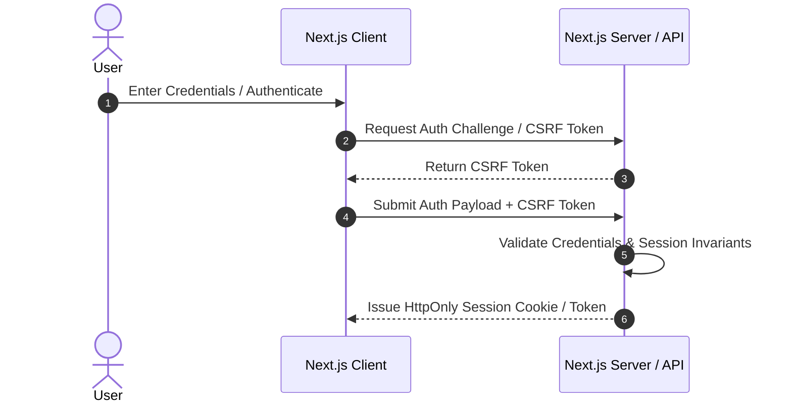

# Authentication Flow Specification

## Scope
- User authentication, CSRF challenge validation, session token issuance, and server session verification.

## Sequence Diagram

## Security Invariants
- Session tokens must be HttpOnly, Secure, and SameSite=Lax/Strict.
- CSRF tokens must be validated with zero replay allowance on state-mutating requests.

Last Updated: 2026-09-21 04:26:52 UTC
