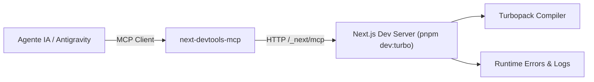

# Next.js DevTools MCP & AI Coding Agents Guide

## Propósito
Este documento define la guía canónica para el uso de `next-devtools-mcp` y las herramientas de desarrollo en tiempo real integradas en Next.js 16+ para agentes de IA y desarrolladores en el repositorio `next-building`.

---

## 1. Arquitectura de Conexión en Vivo

Next.js 16+ expone de forma nativa un endpoint en `/_next/mcp` dentro del servidor de desarrollo. El paquete `next-devtools-mcp` se conecta automáticamente a esta interfaz y proporciona herramientas estructuradas para inspeccionar y compilar la aplicación.



---

## 2. Configuración en `.mcp.json`

El repositorio incluye la configuración oficial en la raíz:

```json
{
  "mcpServers": {
    "next-devtools": {
      "command": "npx",
      "args": ["-y", "next-devtools-mcp@latest"]
    }
  }
}
```

---

## 3. Herramientas Disponibles

| Herramienta MCP | Función Principal | Caso de Uso |
| :--- | :--- | :--- |
| `compile_route` | Dispara la compilación Turbopack de una ruta específica bajo demanda sin requerir navegación manual. | Validar que cambios en `/marketplace` o `/dashboard` compilen limpiamente. |
| `get_compilation_issues` | Recupera advertencias y errores de compilación de todo el proyecto. | Comprobar tipos y bundling inmediatamente después de editar un archivo. |
| `get_errors` | Obtiene errores de compilación, runtime y disparidades de hidratación de sesiones activas. | Diagnosticar errores de SSR vs. cliente en componentes React 19. |
| `get_routes` | Lista todas las rutas del App Router y Pages Router con sus segmentos dinámicos. | Comprender la estructura de rutas antes de proponer cambios. |
| `get_server_action_by_id` | Resuelve el ID interno de una Server Action a su función y archivo de origen. | Depurar invocaciones de Server Actions y formularios asíncronos. |
| `get_logs` | Devuelve la ruta y contenido de los logs del servidor de desarrollo. | Rastrear excepciones no controladas o logs de backend. |

---

## 4. Flujo de Trabajo Recomendado

1. **Iniciar Servidor de Desarrollo**:
   ```bash
   pnpm dev:turbo
   ```
2. **Ciclo de Edición y Verificación (`next-dev-loop`)**:
   - El subagente `frontend` o el desarrollador realiza un cambio en `app/` o `components/`.
   - Ejecuta `compile_route` y `get_errors` a través de MCP para verificar la ruta tocada.
   - Si no hay errores, se procede a las pruebas unitarias y E2E.
3. **Optimización con Cache Components**:
   - Utilizar el skill `next-cache-components-optimizer` para envolver lecturas dinámicas bajo `<Suspense>` y optimizar la navegación instantánea.
